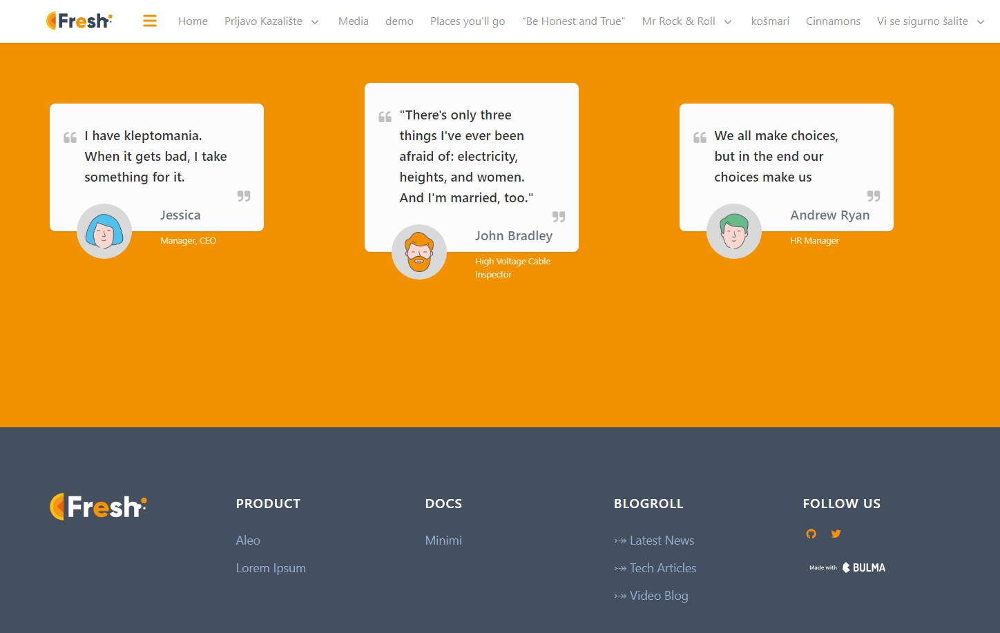

# 🔱fresh 🔱
Grav Theme

## Instructions
This theme is built with new users in mind. That means, everything should be simple.
So having Admin Panel plugin is intended, if you're a `noob`.
You can change **logo** in **Themes » Fresh**
There you can also change social icons by writing only site name: github
and then putting whole link.

In sidebar you can add as many links as you want under categories by your name choice.
There is also Footer tab, right beside the sidebar tab, and there you change footer links.

## Home page instructions
Home page is main page of your site. One that basically looks like template Fresh does.  
You get that look by going to **Pages** » **Page template** » & selecting **Home**.  
There you'll find 5 tabs, each representing **sections of page**, which you can simply edit,
and insert your own content.

## Recommendations
I'd recommend using `Tiny SEO` plugin and `Quick Tray Links` but that's entirely up to you.

## Details

This Grav theme is based on a MIT template **Fresh landing page** built by [CSS Ninja Studio](https://cssninja.io) which is built upon [bulma](http://bulma.io).
Theme is built upon [Haywire](https://github.com/robbinfellow/haywire-grav) starter theme for Grav.

### GPM Installation (Preferred)

The simplest way to install this theme is via the [Grav Package Manager (GPM)](http://learn.getgrav.org/advanced/grav-gpm) through your system's Terminal (also called the command line).  From the root of your Grav install type:

    bin/gpm install fresh

This will install the Gateway theme into your `/user/themes` directory within Grav. Its files can be found under `/your/site/grav/user/themes/fresh`.

### Manual Installation

To install this theme, just download the zip version of this repository and unzip it under `/your/site/grav/user/themes`. Then, rename the folder to `fresh`.

You should now have all the theme files under

    /your/site/grav/user/themes/fresh
    
If you want to set Fresh as the default theme, you can do so by following these steps:

* Navigate to `/your/site/grav/user/config`.
* Open the **system.yaml** file.
* Change the `theme:` setting to `theme: fresh`.
* Save your changes.
* Clear the Grav cache. The simplest way to do this is by going to the root Grav directory in Terminal and typing `bin/grav clear-cache`.

### GPM Update (Preferred)

The simplest way to update this theme is via the [Grav Package Manager (GPM)](http://learn.getgrav.org/advanced/grav-gpm). You can do this with this by navigating to the root directory of your Grav install using your system's Terminal (also called command line) and typing the following:

    bin/gpm update fresh

This command will check your Grav install to see if your Gateway theme is due for an update. If a newer release is found, you will be asked whether or not you wish to update. To continue, type `y` and hit enter. The theme will automatically update and clear Grav's cache.

### Manual Update

Manually updating theme is pretty simple. Here is what you will need to do to get this done:

* Delete the `your/site/user/themes/clean-blog` directory.
* Download the new version of theme from this repository.
* Unzip the zip file in `your/site/user/themes` and rename the resulting folder to `fresh`.
* Clear the Grav cache. The simplest way to do this is by going to the root Grav directory in terminal and typing `bin/grav clear-cache`.

## Thank You

Grav has fantastic team, people that are very helpful and people that I probably bored to death, 
or at least quite a lot to achieve what I want. 
In [Slack's chat room](https://getgrav.slack.com/messages) I bugged 
`@ricardo`, `@photol`, `@johnmica`, `@hugo`, and both Amaury's: `@amauryh` & `AmauryCarrade`
mostly and each of these people helped me a lot, and showed me how to accomplish this and that.
Words cannot express how thankful I am to all of you. I'm the one to blame if anything is wrong, 😅
but you guys helped to get most of the things right. So kudos to you. 

And at last, but not least - Thank You if you're using this theme. 🙂
